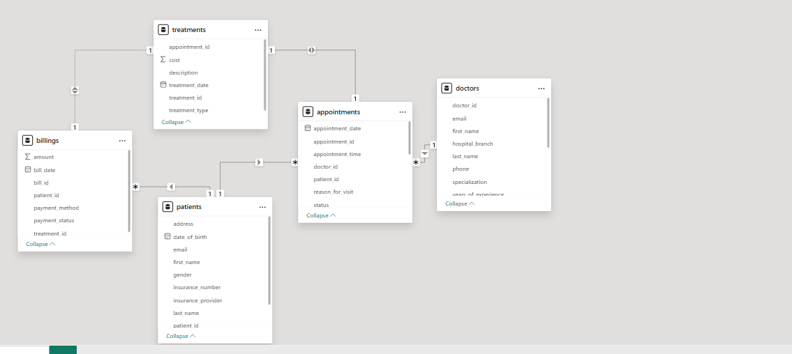
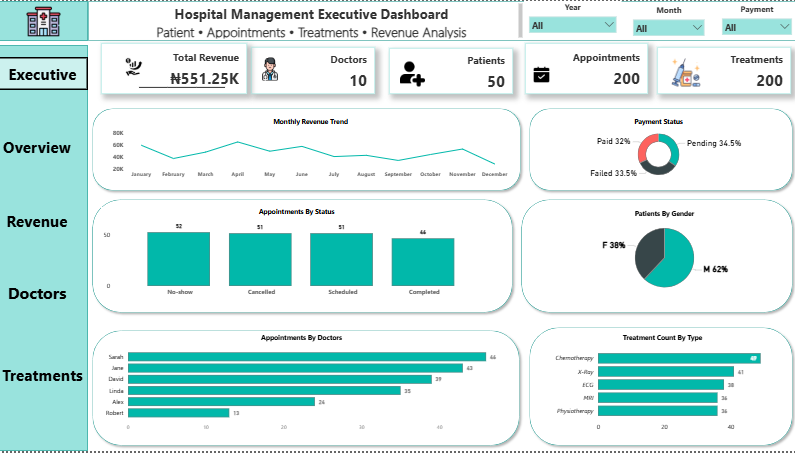
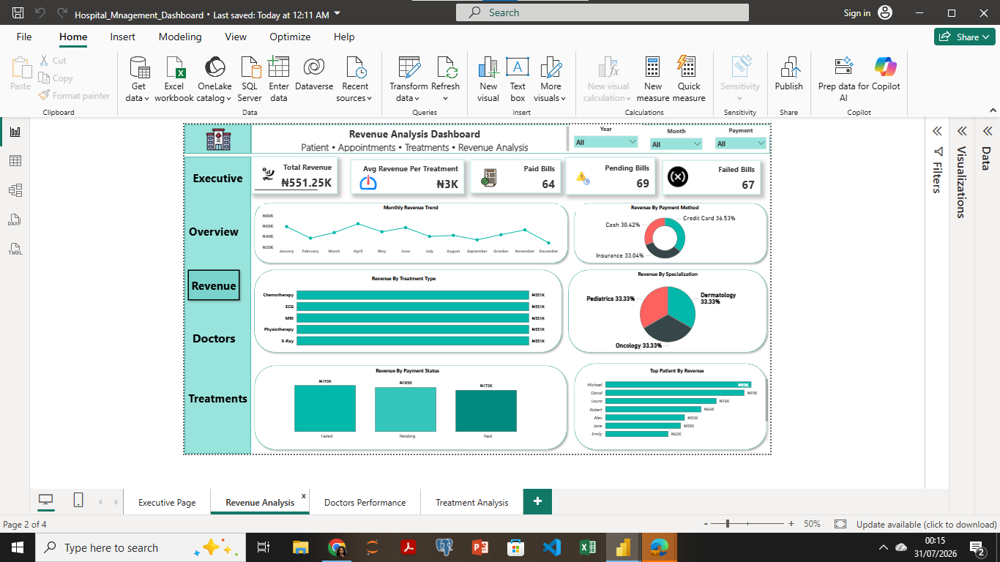
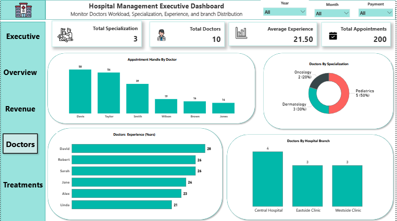
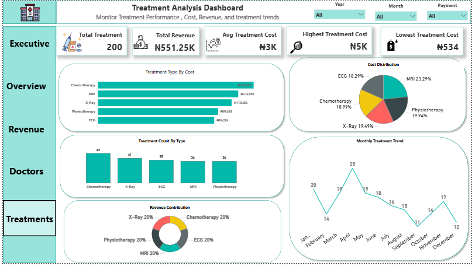

# 🏥 Hospital Management Analytics Dashboard

### Patient • Appointments • Billing • Treatments • Revenue Analysis

An interactive Business Intelligence project that analyzes hospital operations using **PostgreSQL, SQL, Power BI, and DAX**. The dashboard helps hospital management monitor operational performance, financial performance, patient activity, doctor workload, and treatment trends to support data-driven decision-making.


## 📌 Project Overview

Hospitals generate large volumes of operational and financial data every day. This information includes patient records, doctor details, appointments, treatments, and billing transactions. When these datasets are stored separately, it becomes difficult for management to monitor performance, identify operational trends, and make informed decisions.

This project demonstrates how SQL and Power BI can be used to transform raw hospital data into an interactive analytics solution. By integrating multiple datasets into a relational database and developing interactive dashboards, hospital executives can monitor key performance indicators, evaluate operational efficiency, and support strategic decision-making.

## 🛠️ Technologies Used

- **Microsoft Excel** – Data inspection and initial cleaning
- **PostgreSQL** – Database creation and SQL analysis
- **SQL** – Data querying and business analysis
- **Power BI Desktop** – Data modeling, DAX measures, and dashboard development
- **DAX (Data Analysis Expressions)** – KPI and calculated measures
- **GitHub** – Project documentation and version control

## 🎯 Business Problem

The hospital collects data across multiple operational areas, including patients, doctors, appointments, treatments, and billing. However, these records are stored in separate datasets, making it difficult for management to obtain a complete view of hospital operations.

Without a centralized reporting solution, hospital management faces several challenges:

- Difficulty monitoring overall hospital performance
- Limited visibility into revenue and payment status
- Inability to track doctor workload and specialization
- Poor monitoring of patient registrations and appointments
- Lack of timely insights to support operational and strategic decision-making

As a result, managers spend more time gathering information than analyzing it, reducing their ability to respond quickly to operational and financial challenges.

## 🎯 Business Goal

The goal of this project was to design and develop an interactive Hospital Management Analytics Dashboard that provides hospital executives with a centralized view of operational and financial performance.

The dashboard enables management to:

- Monitor hospital revenue and billing performance
- Track patient registrations and appointment activities
- Evaluate doctor workload and specialization
- Analyze treatment performance and costs
- Monitor key performance indicators (KPIs)
- Support data-driven decision-making through interactive visualizations

## ❓ Business Questions

This project was designed to answer the following business questions:

### Executive Dashboard
- What is the hospital's overall operational performance?
- How many patients, doctors, appointments, and treatments are recorded?
- What is the monthly revenue trend?

### Revenue Analysis
- What is the hospital's total revenue?
- Which payment methods contribute the most revenue?
- How many bills are paid, pending, or failed?
- Which treatment types generate the highest activity?

### Doctors Performance
- How many doctors work in the hospital?
- Which doctors handle the highest number of appointments?
- What is the average years of experience among doctors?
- How are doctors distributed across specializations and hospital branches?

### Treatment Analysis
- Which treatment types are performed most frequently?
- What is the average treatment cost?
- Which treatments have the highest and lowest costs?
- How do treatment activities change over time?

## 📂 Dataset Description

The dataset represents a hospital management system and contains operational and financial records across five related tables. Together, these tables provide information about patients, doctors, appointments, treatments, and billing transactions.
The data was imported into PostgreSQL, where relationships were established before being connected to Power BI for analysis and visualization.

## 📊 Data Dictionary

| Table | Description | Key Columns |
|--------|-------------|-------------|
| Patients | Stores patient demographic and registration information | patient_id, first_name, last_name, gender, date_of_birth |
| Doctors | Stores doctor information, specialization, and experience | doctor_id, specialization, years_of_experience |
| Appointments | Records appointments between patients and doctors | appointment_id, patient_id, doctor_id, appointment_date, appointment_status |
| Treatments | Stores treatment details and associated costs | treatment_id, appointment_id, treatment_type, cost |
| Billing | Stores payment transactions for treatments | bill_id, patient_id, treatment_id, payment_method, payment_status, amount |

## 🗄️ Database Design

The project uses a relational database model implemented in PostgreSQL. The five tables are connected through primary and foreign keys to maintain data integrity and support analysis.

### Relationships

- Patients → Appointments (One-to-Many)
- Doctors → Appointments (One-to-Many)
- Appointments → Treatments (One-to-Many)
- Patients → Billing (One-to-Many)
- Treatments → Billing (One-to-Many)

This relational structure allows information to flow across the dataset while minimizing data duplication.

## 🔗 Power BI Data Model

After importing the PostgreSQL tables into Power BI, relationships were created using the primary and foreign keys. This relational model enabled cross-table analysis and supported accurate DAX calculations.

> **Insert Data Model Screenshot Here**

## 🧹 Data Preparation

Before analysis, the dataset was prepared to ensure consistency and accuracy.

The following steps were performed:

- Inspected all five datasets for completeness and consistency.
- Standardized column names and data formats.
- Corrected date formats to ensure compatibility with PostgreSQL.
- Verified data types before importing into the database.
- Imported each table separately into PostgreSQL.
- Validated relationships between tables using primary and foreign keys.
- Connected the PostgreSQL database to Power BI for data modeling and visualization.

## 🗄️ Database Implementation

The hospital dataset was imported into PostgreSQL, where separate tables were created for:

- Patients
- Doctors
- Appointments
- Treatments
- Billing

Each table was imported individually and validated before relationships were established. PostgreSQL served as the central data source for the Power BI dashboard.

## 💻 SQL Analysis

SQL was used to explore the data, validate records, and answer business questions before building the Power BI dashboard.

The analysis included:

- Counting patients, doctors, appointments, and treatments
- Calculating hospital revenue
- Identifying payment status distribution
- Analyzing treatment frequency
- Evaluating doctor workload
- Examining appointment status
- Supporting KPI development for Power BI

### Example SQL Query

```sql
SELECT
    treatment_type,
    COUNT(*) AS total_treatments
FROM treatments
GROUP BY treatment_type
ORDER BY total_treatments DESC;
```
```sql
SELECT
    payment_status,
    SUM(amount) AS total_revenue
FROM billing
GROUP BY payment_status;
```
```sql
SELECT
    doctor_id,
    COUNT(*) AS total_appointments
FROM appointments
GROUP BY doctor_id
ORDER BY total_appointments DESC;
```

## 🎯 SQL Skills Demonstrated

- Data retrieval
- Filtering and sorting
- Aggregate functions
- GROUP BY analysis
- Business-oriented SQL queries
- Database management using PostgreSQL

## 📊 Power BI Implementation

After the data was successfully imported into PostgreSQL, Power BI Desktop was connected to the database to build an interactive analytics solution.

The implementation process included:

- Connecting Power BI to the PostgreSQL database.
- Importing the five related tables.
- Creating and validating table relationships.
- Building DAX measures for KPIs.
- Designing interactive dashboards.
- Applying consistent formatting and navigation across all report pages.

## 🔗 Data Modeling

The dashboard uses a relational data model consisting of five interconnected tables.

Relationships were created using primary and foreign keys to allow information to flow correctly across the model while reducing data duplication.

The relationships include:

- Patients → Appointments
- Doctors → Appointments
- Appointments → Treatments
- Patients → Billing
- Treatments → Billing

This structure allows Power BI to aggregate and analyze information accurately across multiple business areas.

### Power BI Data Model



## 📈 DAX Measures

Several DAX measures were created to calculate key business metrics.

Some of the measures include:

- Total Revenue
- Total Patients
- Total Doctors
- Total Treatments
- Total Appointments
- Average Treatment Cost
- Average Doctor Experience
- Paid Bills
- Pending Bills
- Failed Bills

## 🎨 Dashboard Design

The dashboard was designed with executives and hospital managers in mind.

To improve readability and user experience:

- A consistent color palette was used across all pages.
- KPI cards were placed at the top for quick performance monitoring.
- Navigation buttons were added for easy movement between report pages.
- Charts were selected based on the business questions they answer.
- Visuals were organized to guide users from high-level KPIs to detailed analysis.

## 🏠 Executive Dashboard

The Executive Dashboard provides a high-level overview of hospital performance.

### KPIs

- Total Revenue
- Total Patients
- Total Doctors
- Total Treatments

### Key Visuals

- Monthly Revenue Trend
- Payment Status
- Patients by Gender
- Appointments by Status
- Treatment Count by Type
- Appointments by Doctor



## 💰 Revenue Analysis

This page focuses on the hospital's financial performance.

It enables management to monitor:

- Revenue trends
- Payment methods
- Payment status
- Revenue by specialization
- Top patients by revenue



## 👨‍⚕️ Doctors Performance

This page evaluates doctor workload and workforce distribution.

It includes:

- Total Doctors
- Average Experience
- Appointments by Doctor
- Years of Experience
- Doctors by Specialization
- Doctors by Hospital Branch



## 🩺 Treatment Analysis

This page analyzes treatment activity and associated costs.

It includes:

- Total Treatments
- Average Treatment Cost
- Highest and Lowest Treatment Cost
- Treatment Count by Type
- Monthly Treatment Trend
- Cost Distribution



## 📈 Key Insights

The dashboard revealed several operational and financial insights:

- The hospital maintained consistent revenue throughout the reporting period with only minor monthly fluctuations.
- Most billing transactions were successfully completed, while a smaller proportion remained pending or failed.
- Treatment activity was distributed across multiple treatment types, with some treatments performed more frequently than others.
- Doctor workload varied, indicating opportunities to balance appointments more evenly across staff.
- The hospital employed doctors across multiple medical specializations, supporting a broad range of healthcare services.
- Patient registrations and appointment records provided management with visibility into operational demand.

## 💡 Business Recommendations

Based on the dashboard analysis, the following recommendations can support hospital management:

- Continue monitoring monthly revenue trends to identify seasonal patterns.
- Review pending and failed payments to improve cash flow.
- Balance doctor workloads by monitoring appointment distribution.
- Allocate additional resources to high-demand treatment services where appropriate.
- Use dashboard KPIs during management meetings to support data-driven decision-making.
- Regularly update the dashboard to ensure decisions are based on current operational data.

## ⚠️ Project Challenges

During the project, several technical challenges were encountered:

- Importing CSV files into PostgreSQL required resolving data type mismatches and formatting issues.
- Date fields were standardized to ensure successful database import.
- Relationships between tables were validated to support accurate analysis in Power BI.
- PostgreSQL connection settings were configured to enable successful integration with Power BI.
- DAX measures were refined to ensure KPI accuracy and meaningful visualizations.

These challenges provided valuable experience in data preparation, database management, and business intelligence development.

## 📚 Lessons Learned

This project strengthened my understanding of the complete data analytics workflow, including:

- Data preparation and cleaning
- Relational database design
- SQL querying for business analysis
- PostgreSQL database management
- Data modeling in Power BI
- Creating DAX measures
- Dashboard design and storytelling
- Presenting business insights through interactive visualizations

Most importantly, I learned that effective dashboards are designed to answer business questions rather than simply display charts.

## 🚀 Future Improvements

Potential enhancements include:

- Real-time database connectivity
- Predictive analytics for patient admissions
- Appointment demand forecasting
- Patient satisfaction analysis
- Department-level performance reporting
- Advanced drill-through pages and tooltips

## 👩‍💻 Author

**Esther Ohuenene Emmanuel**

 Data Analyst

### Skills

- SQL
- PostgreSQL
- Power BI
- Microsoft Excel
- Python
- Data Visualization
- Business Intelligence

Feel free to connect with me on LinkedIn and explore more of my projects on GitHub.


